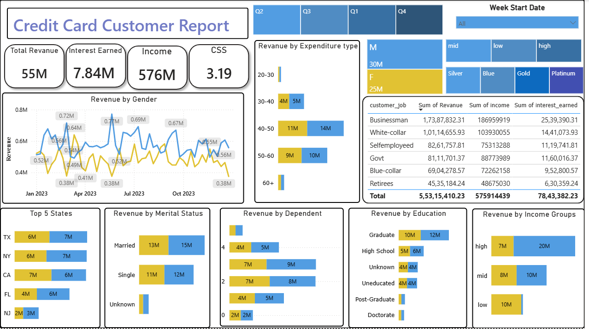
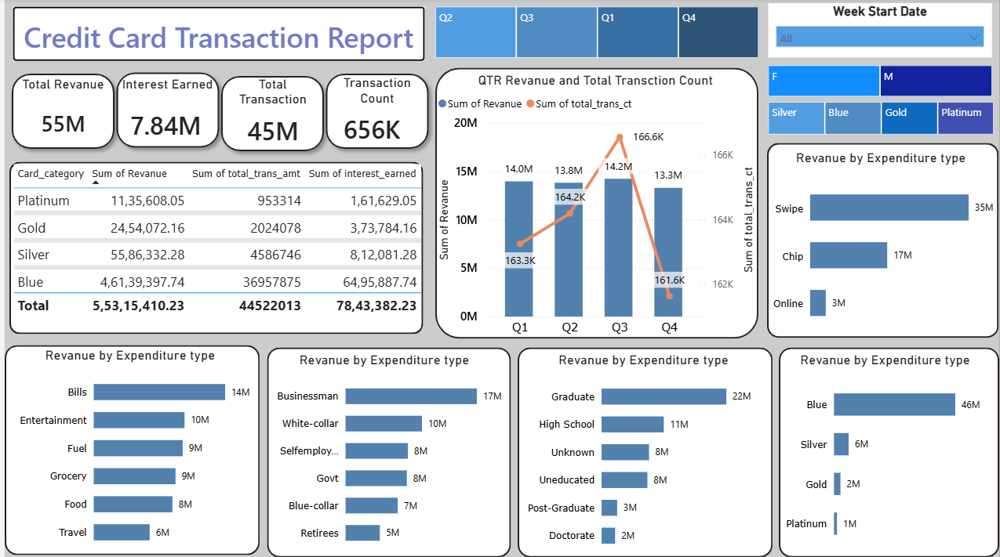

# 💳 Credit Card Analytics Dashboard

## 📌 Project Overview

The Credit Card Analytics Dashboard is an interactive Power BI project designed to analyze customer behavior, credit card transactions, revenue performance, and spending patterns. This dashboard enables financial institutions to monitor key business metrics, understand customer demographics, and identify revenue-driving segments for better decision-making.

---

## 🎯 Business Objective

The objective of this project is to help businesses:

- Monitor overall credit card revenue.
- Analyze customer spending behavior.
- Track quarterly revenue and transaction trends.
- Identify high-value customer segments.
- Compare performance across card categories.
- Support data-driven business decisions.

---

## 🛠️ Tools Used

- Power BI
- Power Query
- DAX
- SQL
- Excel

---

## 📊 Dashboard Preview

### Customer Report



### Transaction Report



---

# 📈 Key KPIs

- **Total Revenue:** 55M
- **Interest Earned:** 7.84M
- **Total Income:** 576M
- **Customer Satisfaction Score (CSS):** 3.19
- **Total Transactions:** 656K
- **Transaction Amount:** 45M

---

# 🔍 Key Insights

## 👥 Customer Analysis

- Male customers generated slightly higher revenue than female customers.
- Customers aged **40–50 years** contribute the highest revenue.
- Businessman and White-collar customers are among the top revenue-generating occupations.
- Graduate customers generate the highest revenue among all education groups.
- Married customers contribute more revenue compared to single customers.
- High-income customers generate the largest share of revenue.
- Texas (TX), New York (NY), and California (CA) are the top-performing states.

---

## 💳 Transaction Analysis

- Total revenue reached **55 Million** across all credit card transactions.
- Q3 recorded the highest quarterly revenue and transaction count.
- Swipe transactions contribute the highest revenue compared to Chip and Online payments.
- Blue Card category generates the highest revenue among all card types.
- Bills, Entertainment, and Fuel represent the highest expenditure categories.

---

## 📈 Business Performance

- Revenue remains relatively stable throughout the year with noticeable peaks during selected months.
- Customer segmentation helps identify high-value customer groups.
- Card category analysis highlights the most profitable products.
- Spending behavior varies significantly across income groups and occupations.

---

# 💡 Business Recommendations

- Focus marketing campaigns on high-income customer segments.
- Increase customer engagement for Platinum and Gold card holders.
- Promote digital payment methods while maintaining swipe transaction security.
- Expand premium credit card offerings for high-value customers.
- Develop personalized offers based on spending categories and customer demographics.

---

# 📂 Dataset

The project uses multiple datasets containing:

- Customer Information
- Credit Card Details
- Transaction Records
- Revenue Data
- Interest Earned
- Income Information
- Card Categories
- Customer Demographics

---

# 📁 Repository Structure

```
Credit-Card-Transaction-Report
│
├── Dashboard
│   └── Credit-Card-Transaction-Report.pbix
│
├── Dataset
│   ├── credit_card.csv
│   ├── customer.csv
│   ├── cust_add.csv
│   └── SQL Queries.sql
│
├── Images
│   ├── cc customer report.png
│   └── cc transaction report.png
│
└── README.md
```

---

# 👨‍💻 Author

**Ranveer Singh**

Aspiring Data Analyst passionate about building interactive dashboards and transforming raw data into meaningful business insights.

### GitHub

https://github.com/ranveeranalytics
